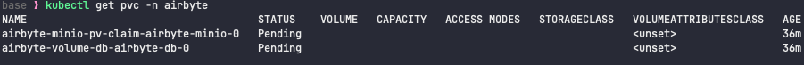
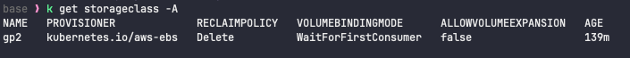

## Issue #1: Managed node group failed to join the EKS cluster

**Description:**
The nodes were ready, but the EKS cluster is stuck in `creating` status. The node group were not able to the EKS cluster.

**Why this happens:**
- some addons (eks-pod-identity-agent & vpc-cni) need to be ready before creating nodegroup.
   Thus I added `before_compute = true` flag.
```ruby
  # EKS Addons
  addons = {
    coredns = {}

    # new pods can assume IAM roles immediately
    eks-pod-identity-agent = {
      before_compute = true # The addon is installed before managed node groups are created.
      # some addons must exist before nodes join the cluster, otherwise node bootstrap may break
    }

    kube-proxy = {}
    vpc-cni = {
      before_compute = true # The addon is installed before managed node groups are created.
    }
  }

```

- However, the creation of addon`vpc-cni` failed with error message: 
```ruby
Conflicts found when trying to apply. Will not continue due to resolve conflicts mode. Conflicts: CustomResourceDefinition.apiextensions.k8s.io policyendpoints.networking.k8s.aws - .spec.versions
```

=> This was the **root cause** why we failed to create the managed node group. Since the Kubernetes nodes could not properly initialize the **CNI plugin**, which was responsible for pod networking, we had to make sure vpc-cni is ACTIVE first.

**My question: Why vpc-cni failed?**
- When Terraform or `kubectl` is trying to install or update the AWS VPC CNI addon, it detects a conflict with an existing CustomResourceDefinition (CRD) `policyendpoints.networking.k8s.aws`.

**How to fix:**
1. Check the version & compared with the one terraform is going to install.

```ruby
kubectl get crd policyendpoints.networking.k8s.aws -o yaml
```
   - in the `.spec.versions` field:
     The existing AWS VPC CNI addon version (in `.spec.versions` field) was `v1alpha1` while the version I was trying to install is `v1.20.4-eksbuild.1`(from aws console). The version I wanted to install expected a **stable and newer API version**. However, Kubernetes did **not allow downgrading or replacing CRD versions easily** — this caused the conflict.

2. Check if the cluster has any CR instances of this CRD:
```ruby
kubectl get policyendpoints.networking.k8s.aws
```

3. If none, we can safely delete this old version & reinstall the vpc-cni via terraform
```ruby
kubectl delete crd policyendpoints.networking.k8s.aws
```

---

## Issue #2: Error while authenticating with cluster: `kubectl get svc`

**Error message:**
```ruby
"Unhandled Error" err="couldn't get current server API group list: the server has asked for the client to provide credentials"
error: You must be logged in to the server (the server has asked for the client to provide credentials)

```

**Why this happens:**

1. Test the endpoint connection
```ruby
curl -vk https://<CLUSTER-ENDPOINT>
```

=> If it hangs or fails with `timeout`, it's likely a **network access** or **SG issue**.

2. IAM principal mismatch
```ruby
The cluster was created with credentials for one IAM principal and `kubectl` is configured to use credentials for a different IAM principal. To resolve this, update your `kube config` file to use the credentials that created the cluster.
```
- ref: https://docs.aws.amazon.com/eks/latest/userguide/troubleshooting.html#unauthorized

**How to fix:**

1. This is likely an access issue, we can try to add access entries. 
   - add access_entries to the EKS module
```ruby
  enable_cluster_creator_admin_permissions = false

  # Access entries to add to the cluster
  access_entries = {
    admin = {
      principal_arn = var.admin_principal_arn
      policy_associations = {
        admin-access = {
          policy_arn = "arn:aws:eks::aws:cluster-access-policy/AmazonEKSAdminPolicy"
          access_scope = {
            type = "cluster"
          }
        }
      }
    }
  }
```

2. upgrade kubectl
- in order to match eks cluster version 1.33
```ruby
which kubectl
=> output: /usr/local/bin/

cd ~/downloads
mkdir kubectl
cd kubectl

curl -O https://s3.us-west-2.amazonaws.com/amazon-eks/1.33.0/2025-05-01/bin/darwin/amd64/kubectl

chmod +x ./kubectl
sudo mv kubectl /usr/local/bin/

kubectl version --client
```
- ref: https://docs.aws.amazon.com/eks/latest/userguide/install-kubectl.html#macos_kubectl

3. upgrade aws CLI
```ruby
cd ~/downloads
mkdir cli
cd cli

curl "https://awscli.amazonaws.com/AWSCLIV2.pkg" -o "AWSCLIV2.pkg"
sudo installer -pkg ./AWSCLIV2.pkg -target /

```
- ref: https://docs.aws.amazon.com/cli/latest/userguide/getting-started-install.html

---
## Issue #3: `kubectl get nodes` error

**Error message:**
```ruby
Error from server (Forbidden): nodes is forbidden: User "arn:aws:iam::xxxxx:user/yyy" cannot list resource "nodes" in API group "" at the cluster scope
```

**How to fix:**

- The user has insufficient privilege and thus I add the following policy to the admin user in the access entries.
```ruby
policy_arn = "arn:aws:eks::aws:cluster-access-policy/AmazonEKSClusterAdminPolicy"
```
- ref: 
  - https://stackoverflow.com/questions/70787520/your-current-user-or-role-does-not-have-access-to-kubernetes-objects-on-this-eks
  - https://docs.aws.amazon.com/eks/latest/userguide/access-policies.html

---
## Issue #4: airbyte db stuck in `Pending` status

For the first attempt, I tried to use PV as Airbyte storage. When I ran `kubectl describe pod airbyte-db-0 -n airbyte`, I got  the following message.

**Error message:**
```ruby
0/2 nodes are available: pod has unbound immediate PersistentVolumeClaims. preemption: 0/2 nodes are available: 2 Preemption is not helpful for scheduling.
```

**Why this happens:**
- Airbyte pods were waiting for storage, but the PersistentVolumeClaim (PVC) they requested wasn’t bound to any PersistentVolume (PV).
- From the output, PVCs were in `Pending` status while storage class was in `waitForFirstConsumer` mode.
```ruby
kubectl get pvc -n airbyte
kubectl get storageclass -A
```



**How to fix:**
- I didn't try to solve the PVC issue. Instead of using the internal Minio instance as storage, I used external storage S3 instead to escape from this PVC error loop.
- ref: https://docs.airbyte.com/platform/deploying-airbyte/integrations/storage
---
## Issue #5: Airbyte pod airbyte-v2-bootloader failed

During Airbyte installation using Helm, pod airbyte-v2-bootloader failed.

**How to debug:**
```ruby
k get pods -A
kubectl logs pod/airbyte-v2-bootloader -n airbyte
```

**Error message in log:**
```ruby
As of version 1.6 of the Airbyte Platform, we require your Service Account permissions to include access to the "secrets" resource. To learn more, please visit our documentation page at https://docs.airbyte.com/enterprise-setup/upgrade-service-account.
```

**How to fix:**

The service account of Airbyte needs read/write access to secrets because Airbyte stores connector credentials in k8s secrets.
Thus, we need to create RBAC for this service account and add relevant permissions.

```ruby
kubectl apply -f airbyte-role.yaml
kubectl apply -f airbyte-rolebinding.yaml
```
=> I baked the RBAC into terraform code `terraform/stage5-airbyte/airbyte.tf`.

---
## Issue #6: Too many airbyte pods error

In the initial attempt, the worker pod(s) were not running, I tried `kubectl describe po xxx -n airbyte` to check the reason. Then I got following message.

**Error message:**
```ruby
0/1 nodes are available: 1 Too many pods. preemption: 0/1 nodes are available: 1 No preemption victims found for incoming pod
```

**How to fix:**
- It was probably due to not enough resources provided by the nodes. Thus I tried to increase the instance size for the core node to `t4g.large`.

```ruby
# increase instance size
cd ../stage1-eks
terraform apply --auto-approve

# re-install airbyte
cd ../stage5-airbyte
helm uninstall airbyte-v2 --namespace airbyte
terraform apply --auto-approve

```

=> result: problem solved.

---
## Issue #7: Failed to create postgres source connector in Airbyte

After I filled in all the fields to create postgres source connector in Airbyte, I tried to test connection. Then I got the error message.

**Error message:**
```ruby
Configuration check failed Workload failed, source: workload-launcher 

Internal message: io.airbyte.workload.launcher.pipeline.stages.model.StageError: io.airbyte.workers.exception.KubeClientException: Failed to create pod rce-postgres-...
```

**What this error means:**
- The Airbyte Workload Launcher (the component responsible for spawning short-lived pods for each connection/source/destination check) **could not create the pod**.

**How to debug:**
- check if the workload launcher has permission to create pods in `airbyte` namespace
```ruby
kubectl get clusterrolebinding | grep airbyte
kubectl get rolebinding -n airbyte | grep workload-launcher

kubectl get events -n airbyte --sort-by='.metadata.creationTimestamp'

kubectl logs deployment/airbyte-workload-launcher -n airbyte | tail -n 50
```

**How to fix:**
```ruby
helm get values airbyte-v2 -n airbyte
```

- And look for the value of serviceAccount under workloadLauncher in helm chart values.
```ruby

# helm chart values
workloadLauncher:
  serviceAccount:
    name: airbyte-sa
```

- Alternatively, you can try
```ruby
kubectl get deploy airbyte-v2-workload-launcher -n airbyte -o yaml | grep serviceAccountName
```

- If missing, we need to explicitly fill in serviceAccount for workloadlauncher  in values.yaml:
```yaml
workloadLauncher:
  serviceAccount:
    create: false
    name: airbyte-sa
```

- then relaunch airbyte.
```ruby
cd ../stage5-airbyte
helm uninstall airbyte-v2 --namespace airbyte
terraform apply --auto-approve
```

- verify permissions for workload launcher(service account = airbyte-sa), expecting output as `yes`.
```ruby
kubectl auth can-i create pods --as=system:serviceaccount:airbyte:airbyte-sa -n airbyte
kubectl auth can-i create jobs --as=system:serviceaccount:airbyte:airbyte-sa -n airbyte
```

--
**My Question:**
- I thought I already created ClusterRole for Airbyte `airbyte-admin-role`, but I still needed to create a new ClusterRole `airbyte-workload-launcher-role` for workload launcher. Why?
  => It is because the **workload launcher** runs _separately_ from the main Airbyte pods, and it **needs its own RBAC permissions** to create short-lived pods for source/destination/job execution.

**How I fixed this issue:**
- For simplicity, I didn't create an extra role and SA for workload launcher. I used the same clusterrole for workload-launcher and airbyte admin.
-  I had the clusterrole `airbyte-admin-role` to include permissions that workloadLauncher would need and assigned this role to `airbyte-sa` , then referenced `airbyte-sa` under workloadLauncher in values.yaml.

---
## issue #8: Failed to create destination connector at airbyte

- While testing connection with the destination `s3 data lake`, i got the following error message.

**Error message:**
```ruby
Could not connect with provided configuration. Error: User: arn:aws:sts::xxx:assumed-role/airbyte-AirbyteRole/aws-sdk-java-xxx is not authorized to perform: glue:GetDatabase on resource: arn:aws:glue:xxx:xxx:database/airbyte_test_namespace because no identity-based policy allows the glue:GetDatabase action (Service: Glue, Status Code: 400, Request ID: xxx)
```

**How to fix:**
- Edit the IAM policy for the IAM role `airbyte-AirbyteRole` to include below 
```ruby
Resource = [
...
  "arn:aws:glue:*:*:database/airbyte_test_namespace",
  "arn:aws:glue:*:*:table/airbyte_test_namespace/*"
	  
]
```

---
## issue #9: Failed to do CDC sync in Airbyte

**Error message:**
```ruby
Failure in source: Saved offset is before replication slot's confirmed lsn. Please reset the connection, and then increase WAL retention and/or increase sync frequency to prevent this from happening in the future. See https://docs.airbyte.com/integrations/sources/postgres/postgres-troubleshooting#under-cdc-incremental-mode-there-are-still-full-refresh-syncs for more details.
```

**What does it mean?**

**Airbyte's stored CDC position (offset) is behind the oldest WAL segment Postgres still keeps**. In other words, Postgres has already recycled (deleted) the WAL logs that Airbyte needs to continue CDC streaming.

**Why this happens?**

- Postgres WAL retention is too short (default might be 1 day or less).
- Airbyte did not sync often enough, so the replication slot's needed WAL logs got cleaned up.
- Airbyte is trying to resume CDC from a point that no longer exists in Postgres WAL.

**How to fix?**

1. Reset the Airbyte connection offset
	- In Airbyte UI, go to the **Connection settings**.
	- Find **"Reset connection"** or **"Reset sync"** (varies by version).
	- This clears the saved CDC offset so Airbyte will do a fresh full snapshot + CDC.
2. Increase Postgres WAL retention
   - You want to ensure Postgres keeps WAL logs long enough for Airbyte to catch up.
   - Modify RDS parameters:
    - Increase `wal_keep_size` (in MB) — e.g., 1024 or more.
	- Increase `max_wal_size`
	- Ensure `max_replication_slots` is sufficient.
   - Then, you may need to REBOOT RDS to reflect the changes.

```ruby

# debug in postgres
SELECT * FROM pg_replication_slots ;

SELECT slot_name, 
pg_size_pretty(pg_wal_lsn_diff(pg_current_wal_lsn(),restart_lsn)) AS replicationSlotLag, 
active 
FROM pg_replication_slots ;

```

---
