# How Modern CDC Meets the Lakehouse: Airbyte → Iceberg on EKS
Explore Airbyte's Change Data Capture (CDC) synchronization running on EKS

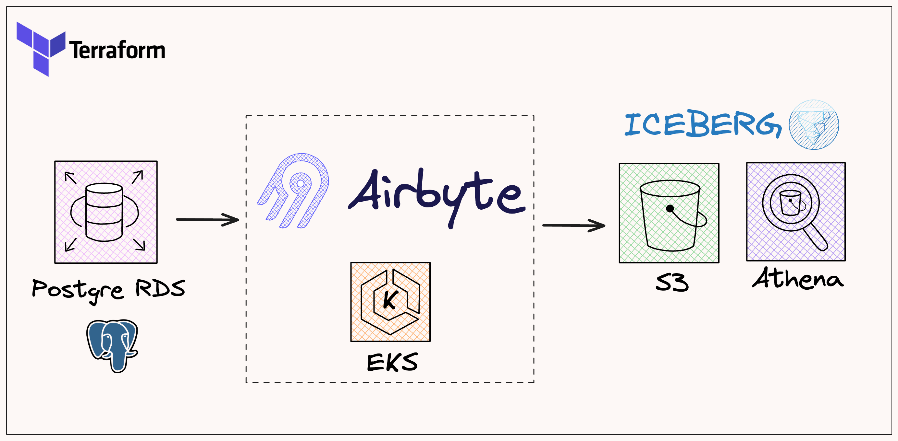
## Goal
The goal of this exercise is to build a reliable and scalable CDC (Change Data Capture) pipeline using Airbyte that replicate data from a Postgres source into an Iceberg data lake on AWS S3. 

This project demonstrates:
- Using Terraform to modularize AWS infrastructure
- Deploying Airbyte on EKS with IRSA and dedicated node groups
- Configuring Postgres logical replication for CDC
- Delivering CDC events to an Iceberg table format on S3
- Querying incremental snapshots in Athena
- Validating CDC behaviour with test inserts/updates/deletes
- Following production patterns (network isolation, bastion host, IAM roles, etc.)

---
## Introduction

Before starting, let's study a bit about Airbyte.
### What is Airbyte?
Airbyte is an open-source data movement platform that extracts data from various sources (APIs, databases, SaaS tools) and loads it into destinations such as data warehouses and data lakes.  It supports **Change Data Capture (CDC)** through Debezium, allowing event-based replication instead of full table reloads.
### Why choose Airbyte?
I get confused between Airflow vs Airbyte since Airflow seems can do the job then why do we choose Airbyte over Airflow?
Airflow and Airbyte serve different purpose: 
- **Airflow**: 
	- For workflow orchestration to schedule ETL/ELT tasks and mange dependencies between tasks. 
	- Requires writing Python code/operators to perform data movement
	- Very flexible — suitable for custom pipelines or complex business logic
- **Airbyte**:
	- Specializes in **data ingestion** (EL) with hundreds of pre-built connectors
	- Provides built-in support for incremental syncs, CDC, and schema evolution
	- Reduces custom coding since connectors handle extraction and loading
	- Designed for cost-efficient ingestion — avoids full reloads when only changes need to be synced
	- Transformations are limited and usually delegated to `dbt` or other transformation tools

>  If the use case is mainly on data ingestion — especially when CDC is required, Airbyte might be a stronger fit since it reduces custom coding overhead using prebuilt connectors and helps on incremental syncs.

### Key Concepts on Airbyte
Please refer to [1_Concepts_on_Airbyte](1_Concepts_on_Airbyte.md).

---
## Architecture

This project deploys Airbyte on Amazon EKS in a secure, production-style network design. 
### VPC
- 3× **public subnets** and 3× **private subnets** across 3 AZs
- Public subnets host load balancers and bastion host
- Private subnets host EKS worker nodes and RDS instances
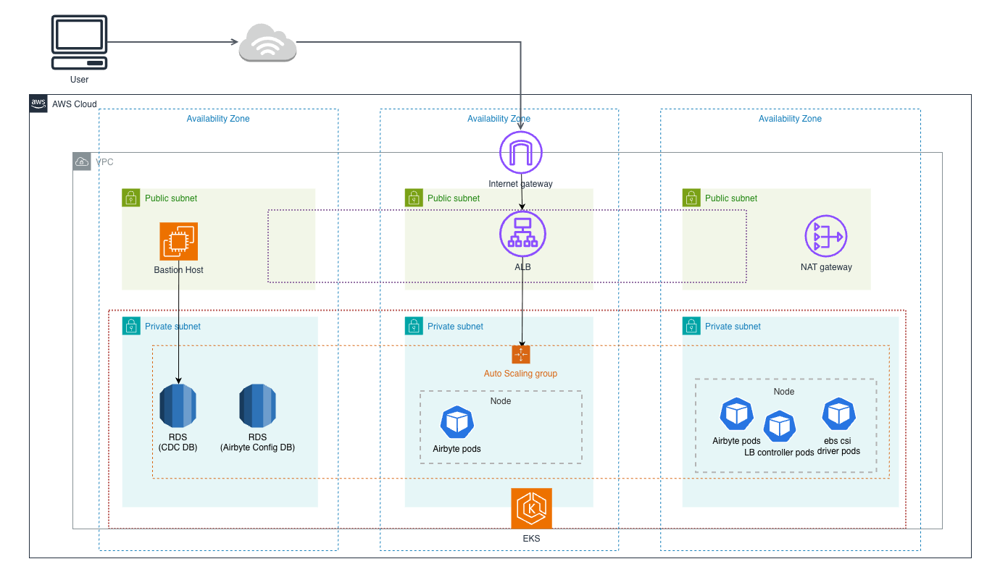
- Note: can also refer to my old exercise which explains the similar architecture set up.
  (https://github.com/chanchanngann/data-streaming-on-eks/blob/main/README.md)

### EKS Cluster
##### Control Plane
- Fully managed by AWS and reachable through a **public endpoint** for development convenience
- **Private endpoint** enabled so worker nodes communicate over internal VPC network
- In production, API access would typically be restricted to Bastion/VPN users

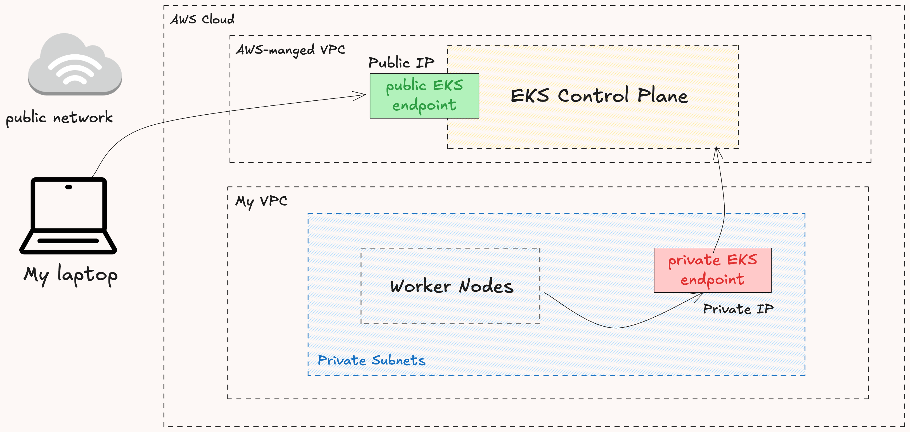
##### Worker Nodes (AWS Managed Node Group)
- EC2 instances deployed in private subnets
- Outbound internet access via NAT Gateway
- No direct inbound exposure
##### Networking
- Nodes communicate with the control plane via private endpoint
- Applications exposed to the internet through ALB Ingress (for dev setup)
- Internal communication remains isolated inside private subnets

** **For more details on the architecture and key decisions, please refer to [2_Architecture](2_Architecture.md) page.**

---
## Prerequisites
- AWS CLI configured
- Terraform installed
- kubectl
- helm
- eksctl
---
## Part A — Deploy Airbyte on EKS
To maintain a clean separation between AWS infrastructure and Kubernetes-level components, the deployment workflow is divided into **five stages**. Terraform is used to provision all AWS resources and bootstrap the EKS environment.

The infra is divided into 5 stages.
### Shared Terraform Plugin Cache
To avoid downloading provider binaries repeatedly across stages, a shared plugin cache is configured.
- Terraform supports a shared directory for providers through the `TF_PLUGIN_CACHE_DIR` environment variable.
- Example in `~/.terraformrc`:
```bash
plugin_cache_dir = "$HOME/.terraform.d/plugin-cache"
```
- This way, all stages reuse the same cached providers, improving speed and consistency.
---
### Stage 1. Create EKS cluster

This stage provisions the foundational AWS infrastructure and the Kubernetes control plane.
##### VPC Module
- Creates the networking layer (public/private subnets, NAT gateways, routing tables) required for a fully functional EKS cluster.
##### EKS Module
- Creates
	- The EKS cluster (EKS control plane)
	- Worker node Auto Scaling Groups
	- IAM Roles and Policies required for the EKS cluster
	- Security Groups and cluster networking dependencies
##### Node Group Strategy
- To support Airbyte’s runtime behavior and avoid noisy-neighbor interference, two AWS-managed node groups are created with different **node selector labels**.
1. **Code Nodes (low-resource workloads)**
	- Hosts: Airbyte web app, web server, cron, temporal etc. 
	- Characteristics: Mostly control-plane and UI components; low CPU/memory usage.
	- label: 
	  `airbyte_node_type = core`
2.  **Worker nodes (high-resource workloads)**: 
	- Hosts: Airbyte worker pods executing sync jobs. 
	- Characteristics: High CPU/memory demand, sometimes bursty workloads.
	- label: 
	  `airbyte_node_type = worker`
=> Pods are scheduled onto the appropriate nodes using `nodeSelector` depending on workload isolation needs.
##### Steps

1. Set up  VPC and EKS stacks.
```ruby
cd <project_folder>/terraform
cd stage1-eks

terraform init
terraform plan
terraform apply --auto-approve
```
Note: for every module, you need to init to install the modules first.
2. Check if the cluster is ready on AWS console EKS page. 
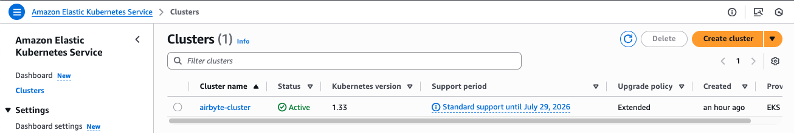

3. Once the EKS cluster is ready, we proceed to authentication: enable the `kubctl` utility to communicate with the API server of the cluster. You can switch to the desired aws profile using `--profile` flag and context using `--alias` flag.
```ruby
aws eks update-kubeconfig --region ap-northeast-2 --name airbyte-cluster --profile mydefault --alias admin-context
```

4. Test connection and check if the label `airbyte_node_type` are applied on nodes.
```ruby
kubectl get svc
kubectl get nodes -L node.kubernetes.io/instance-type -L airbyte_node_type
```
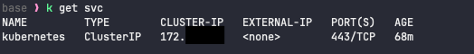

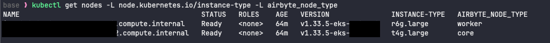

##### Optional Steps: Add Access Entries for new user
1. You can create a new user `dev_user` and grant the user with EKS read-only access (This is done in the terraform code).  
2. Configure this new user with a separate aws profile and use this profile to authenticate to EKS cluster. This will create a new context for the new user.
```ruby
# get access key & secret key
cd stage1-eks
terraform output dev_user_access_key_id
terraform output -raw dev_user_secret_access_key

# enter access key & secret key
aws configure --profile dev_user

# authenticate using this user profile
aws eks update-kubeconfig --region ap-northeast-2 --name airbyte-cluster --profile dev_user --alias dev-context
```
3. You can check the available contexts and the current context.
``` ruby
kubectl config get-contexts
kubectl config current-context
```
4. Switch between contexts for different IAM user.
```ruby
# user admin
kubectl config use-context admin-context

# user dev_user
kubectl config use-context dev-context
```
5. Check the access behaviour.
	- admin-context: should return "yes"
	- dev-context: should return "no"
```ruby
kubectl --context=admin-context auth can-i delete pod
kubectl --context=dev-context auth can-i delete pod
```
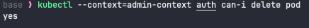
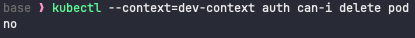
6. May need to edit `~/.kube/config` if the access behaviour is not correct. Make sure each user is using the correct AWS profile.

---
### Stage 2. EKS Add-ons
These add-ons extend the EKS cluster with required AWS integrations: 
##### AWS Load Balancer Controller (via `helm_release`)
- Manages the lifecycle of AWS ALBs based on Kubernetes Ingress resources.
- Required for exposing Airbyte UI/API via HTTPS/HTTP.
##### EBS CSI Driver (via `helm_release`) - Optional
- Manages provisioning of EBS volumes.
- Optional for Airbyte if you are not using PersistentVolumes (in this setup, S3 is used for logs and CDC outputs).
##### Steps
1. Configure Kubernetes & Helm providers. After Stage 1 EKS is ready, feed its endpoint/CA/token from `data.aws_eks_cluster` into the `kubernetes` and `helm` providers configuration.
```ruby
cd ../stage2-addons
terraform init
```
2. Deploy Helm charts. Once the `helm` provider can talk to the cluster, install ALB Controller and CSI EBS driver.
```ruby
terraform plan
terraform apply --auto-approve
```
3. Verify if the installations are successful. The output should return load-balancer-controller and ebs-csi-controller 
```ruby
kubectl get deployment -n kube-system
```
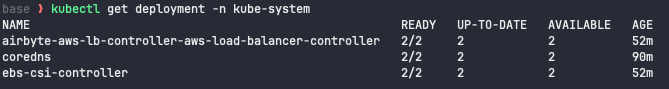

---
### Stage 3. Bastion Host
- Provides secure administrative access into private subnets (to access the private RDSs.).
##### Steps
1. Set up bastion host in public subnet, and get the public IP of bastion host.
```ruby
cd ../stage3-bastion
terraform init
terraform apply --auto-approve

## when bastion is ready
terraform output bastion_public_ip

```

2. SSH into the bastion host using your key pair `<keypairname>.pem`. This key pair should be first baked into terraform code when creating the bastion host.
```ruby
cd <project_folder>
ssh -i auth/<keypairname>.pem ec2-user@<bastion_public_ip>

```

---
### Stage 4. Deploy RDS (Postgres)
- Airbyte Config Database (RDS PostgreSQL): prerequisite for the deployment of Airbyte using the external DB option
- CDC Source Database (RDS PostgreSQL): used as source DB in the CDC pipeline.
##### Steps
1. Set up the config DB and CDC source DB.
```ruby
cd ../stage4-rds

terraform init
terraform plan
terraform apply --auto-approve
```
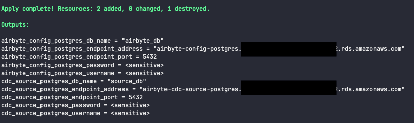
**Note:**
- Need to create resource `aws_db_parameter_group` to override some parameters.
- parameter: `rds.force_ssl` (set it to 0)
	- `rds.force_ssl` is an Amazon RDS–specific parameter. It is default value is `rds.force_ssl = 1` (forces all connections to use SSL). With setting `value = 0` means **disable forced SSL**.
	- Airbyte’s Temporal service sometimes cannot connect if RDS requires SSL but the client hasn’t been configured with SSL certificates. This change allows Temporal to connect without SSL.
- parameter: `rds.logical_replication` (set it to 1)
	- to enable this parameter, we have to **reboot** the RDS instance. You either
		- Go to AWS console → RDS → Databases →  click on the cdc database → Actions → **Reboot** 
		- add `apply_method = "pending-reboot"` in terraform code
2. We need to test the connectivity to the CDC DB. First, get the endpoint of CDC DB.
```ruby
cd ../stage4-rds
terraform output cdc_source_postgres_endpoint_address
terraform output cdc_source_postgres_endpoint_port
```
3.  SSH into the bastion host. We want to test the basic connectivity from the bastion host to RDS.
```ruby
# local terminal
cd <project_folder>
ssh -i auth/<keypairname>.pem ec2-user@<bastion_public_ip>

# in bastion shell: install netcatnc
sudo yum install -y nc

# in bastion shell: test connection to rds
nc -zv <cdc_source_postgres_endpoint_address> 5432
```

4. Quit the bastion shell. From the local terminal, we can use **SSH tunneling** to connect  to RDS through the bastion.
```ruby
# local terminal
cd <project_folder>
ssh -i <key_pair>.pem -f -N -L 5432:<cdc_source_postgres_endpoint_address>:5432 ec2-user@<bastion_public_ip>
```
What is this command doing?
-  `-L 5432:<rds-endpoint>:5432` forwards local port `5432` to bastion → RDS on `5432`
- `-N` → don’t run remote commands (just do port forwarding).
- `-f` → put SSH in the **background** after authentication.

5. Verify if the tunnel is active. The output confirms the local port `5432` is forwarded to the private RDS through bastion.
```ruby
lsof -i :5432
```
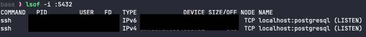
6. From the local laptop (while the tunnel is active), use any PostgreSQL client to connect to the RDS Postgres. Configure the client as below.
	- **Host**: `localhost`
	- **Port**: `5432`
	- **Database**: CDC database name you created on RDS
	- **Username / Password**: RDS credentials
	- **SSL mode**: `require` (or enable SSL in client)

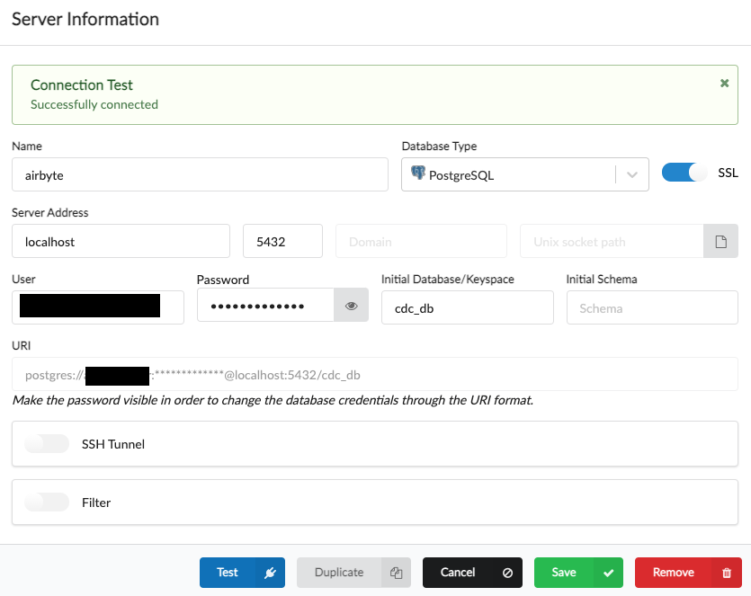

---
### Stage 5. Deploy Airbyte

- Deploy Airbyte using the **Helm Chart v2**.
- Configure Airbyte through a custom **`values.yaml`**:
	- Storage
		- Set storage type to **S3** for logs and artifacts.
		- Use `authenticationType: instanceProfile` so Airbyte pods can access S3 via **IRSA**.
	 ref: https://docs.airbyte.com/platform/deploying-airbyte/integrations/storage
	- External Database
		- Use an external **RDS PostgreSQL** instance as the Airbyte config database (instead of the bundled Postgres).
		- Enter the Kubernetes secret `airbyte-config-secrets` (secret created via terraform).
	- Pod Scheduling
		- Use custom `nodeSelectors` to separate workloads
		- Core components (API, server, webapp, Temporal, cron) → `airbyte_node_type: core`
		- Worker pods (sync jobs) → `airbyte_node_type: worker`
	- **Resource requests/limits**
		- Set up CPU/memory requests and limits to ensure predictable scheduling and prevent resource contention.
##### Steps
1. Use terraform to set up the following resources:
	   - IRSA role for Airbyte
	   - S3 bucket for Airbyte storage
	   - Airbyte via Helm customized by values.yaml
```ruby
cd ../stage5-airbyte

terraform init
terraform plan
terraform apply --auto-approve

```

2. When deploy is done, check the airbyte pods and services in airbyte namespace. You can find the port number in the output of `kubectl get svc` . This port number is referenced in ingress YAML.
```ruby
kubectl get svc -n airbyte
kubectl get pods -n airbyte
kubectl get deploy -n airbyte
kubectl get secret -n airbyte
kubectl get sa -n airbyte
kubectl get clusterrole -n airbyte | grep admin
kubectl get clusterrolebinding -n airbyte | grep admin

# check if the service account is link with the IRSA role
kubectl describe sa airbyte-sa -n airbyte

# check the airbyte logs
kubectl -n airbyte logs pod_id --tail 50
```

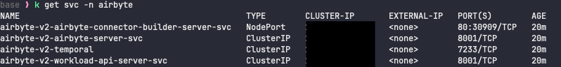
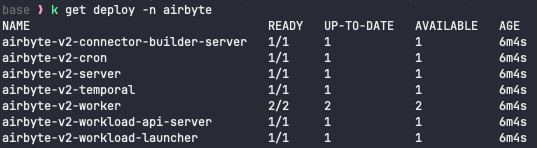

3. To create ingress via HTTPS, we need to create ACM cert first: Create TLS certificate, import to ACM and annotate the Ingress to use the ACM cert ARN.
   a. create certificate
   b. import to ACM and copy the ARN value.
```ruby
openssl genrsa -out tls.key 2048
openssl req -new -x509 -key tls.key -out tls.cert -days 360 -subj "/CN=rachel.airbyte.com"
```

4. Create ingress resource using `airbyte-ingress.yaml`.
   - Add the ACM annotation: `alb.ingress.kubernetes.io/certificate-arn`
   - Use **main API server** as the backend service: `airbyte-v2-airbyte-server-svc`
   - Port number: 8001
```ruby
cd ../stage5-airbyte
kubectl create -f airbyte-ingress.yaml
```
5. In AWS console, check and wait until the load balancer is ready. It takes some time to provision the load balancer.
	- make sure ACM certificate is imported
	- make sure LB listener includes `443`
	- make sure load balancer security group inbound rule includes HTTPS 443 traffic
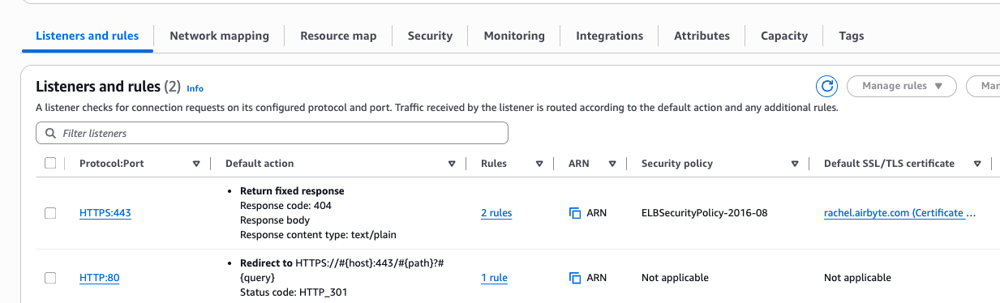

6. When ALB is provisioned, get the IP of the ingress.
```ruby
kubectl get ingress -n airbyte
nslookup k8s-airbyte-airbytei-xxx.xxx.elb.amazonaws.com
```
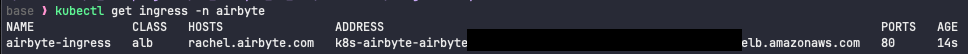
7. Update the local `/etc/hosts` file to map the ALB Controller’s external IP to the Airbyte HTTPS hostname.
```ruby
sudo vi /etc/hosts

# @hosts file, add the IP
12.34.56.78 rachel.airbyte.com
```

8. Go chrome browser and access Airbyte!
```ruby
https://rachel.airbyte.com
```
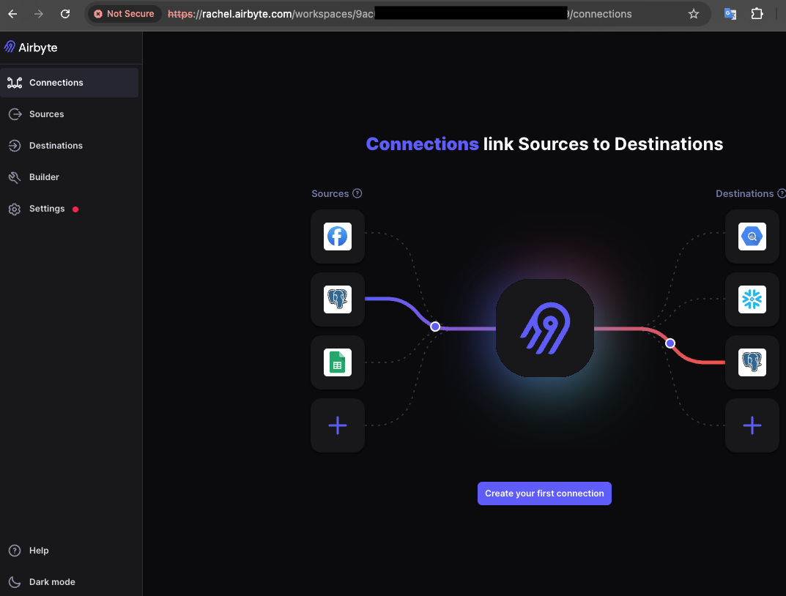

---
## Part B — Set up CDC synchronization on Airbyte

This part sets up a **Postgres → Iceberg** CDC pipeline using Airbyte:
- **Source:** RDS Postgres (logical replication / WAL-based CDC)
- **Destination:** Iceberg tables stored on **S3**, with **Glue Catalog** as the metastore

**What is CDC in Airbyte?**
Change Data Capture (CDC) allows Airbyte to read **inserts, updates, and deletes** directly from the Postgres Write-Ahead Log (WAL), instead of scanning tables or relying on cursor fields.

Airbyte uses **logical replication** to stream these WAL events and apply them to the destination.

**Why use CDC?**
Traditional _incremental sync_ depends on a **cursor** like `updated_at` to detect new or changed rows, and will fail if:
- no cursor field exists
- timestamps are not reliable
- updates don’t modify the timestamp
=> With CDC, **no cursor field** is required because changes are captured as events. Postgres tracks every change in the Write-Ahead Log (WAL) so that Airbyte can read directly from the WAL stream via logical replication.
ref: https://www.postgresql.org/docs/current/logicaldecoding-explanation.html

**CDC is ideal when:**
- The source DB is large (hundreds of GB+), so full refresh is impractical
- Tables have **primary keys** but lack a reliable **cursor field** for incremental syncing
- You want to capture **deletes** in the table

**Airbyte only requires:**
- **logical replication enabled** on Postgres
- **primary key** on tables

**Iceberg as the Destination (data on S3 + Glue Catalog)**
Airbyte writes CDC updates into an Iceberg table stored on S3, with table metadata managed by Glue Catalog. Athena queries the latest snapshot directly.

**How Airbyte writes:**
Airbyte uses **Merge-on-Read (MoR)** for Iceberg.
- Inserts → new Parquet files
- Updates/deletes → lightweight delete files
- Iceberg merges data + delete files **logically** at query time

**Merge-on-Read vs Copy-on-Write in Iceberg**
- **Copy-on-Write (CoW):** rewrites whole Parquet files on update/delete → faster reads, expensive writes
- **Merge-on-Read (MoR):** writes lightweight “delta/delete” files → cheaper writes, slightly slower reads until compaction    

**Why MoR?**  
- CDC generates many small changes—MOR avoids rewriting whole files, making writes fast and efficient.

**Querying the latest snapshot from Athena**
- Once Airbyte writes incremental CDC batches, we can query from Athena to see the latest snapshot of data.
```sql
SELECT * FROM iceberg_db.table_name;
```

**Data flow:**
```ruby
Postgres (WAL / Logical Replication)
 ↓
Airbyte Source: Postgres CDC
 ↓
Airbyte Destination: S3 (Iceberg data + metadata)
 ↓
Glue Catalog (Iceberg table metadata)
 ↓
Athena (query the latest snapshot)
```

ref: 
https://docs.airbyte.com/integrations/sources/postgres
https://docs.airbyte.com/integrations/destinations/s3-data-lake
https://airbyte.com/tutorials/incremental-change-data-capture-cdc-replication
---
### Step 1: Create table & user in Postgres

1. Create table and insert some data. You can refer to this SQL file `sql/1_source_ddl.sql`
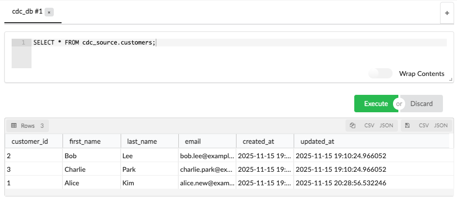

2. Create a dedicated read-only user for replicating data in Airbyte. Then grant this user with **read-only** access to relevant schemas and tables, as well as replication privileges. For privileges part, you can refer to `sql/2_privileges.sql`
```sql
CREATE USER cdc_user PASSWORD 'Password123';
```

### Step 2: Set up Postgres Source Connector in Airbyte

1. Create a new source `Postgres`.
```ruby
- source name: cdc-source
- host: <host name of the Postgres DB>
- port: 5432
- database: cdc_db
- schema: cdc_source (By default, `public` is the selected schema.)
- username: cdc_user (created in step 1)
- password: Password123
- Update Method: Scan Changes with User Defined Cursor (for testing only, will modify this option later)
```

2. Test the connection.
### Step 3: Configure CDC in Postgres

1. Enable logical replication by changing the RDS parameter value. The parameter `rds.logical_replication` is baked into the terraform code. When RDS is up, go to the AWS console -> RDS -> parameter group page -> verify the following values:
```ruby
- rds.logical_replication = 1 (so that wal_level will be set to `logical`)
- max_wal_senders : at least 1 
- max_replication_slots: at least 1
```
- `WAL` refers to write ahead log, which is the transaction log file that captures inserts/updates/deletes. Airbyte uses this log file to read the transactions and replicate them into a destination.
- Note: you need to **REBOOT** the RDS instance if you make change to the parameter `rds.logical_replication` after RDS is up.

2. In Postgres, add the replication identity for each table you want to replicate.
```sql
ALTER TABLE cdc_source.customers REPLICA IDENTITY DEFAULT;
```
3. Create publication to allow subscription to the events of the table.
```sql
CREATE PUBLICATION airbyte_pub FOR TABLE cdc_source.customers;
```
4. Create a replication slot in Postgres.
```sql
SELECT pg_create_logical_replication_slot('airbyte_slot', 'pgoutput');
```
- What is replication slot in Postgres?
  It is a mechanism to keep track of which changes have been consumed by replication clients (Airbyte). The changes happen in Postgres are captured by WAL, the replication slot keeps the "last read position" (LSN = Log Sequence Number) of the WAL. So that, the CDC tool (Airbyte) can safely stream all data changes without losing any data, even if the connection is temporarily unavailable. Airbyte can **resume from the exact point it left off** if the sync restarts.

5. Verify if the replication slot is set up successfully. The output should tell the replication slot name 'airbyte_slot'.
```sql
SELECT * FROM pg_replication_slots;
```
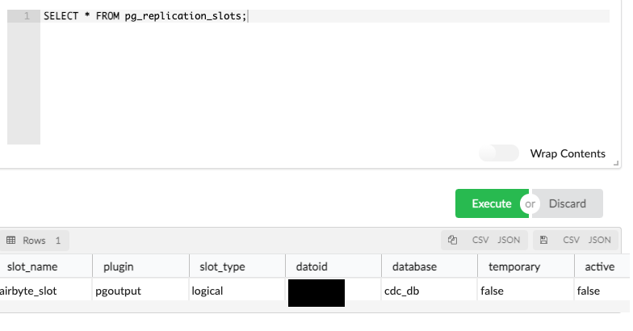

6. Give the user `cdc_user` replication privileges. This allows Airbyte (cdc_user) to create logical replication slots.
```ruby
GRANT rds_replication TO cdc_user;
```

### Step 4: Enable CDC replication in Airbyte

1. Go to the source Postgres connector `cdc-source` created in step 2 and select CDC as the update method.
```ruby
- update method: `Read Changes using Write-Ahead Log (CDC)`
- replication slot: airbyte_slot
- publication: airbyte_pub
```
2. Test the connection.
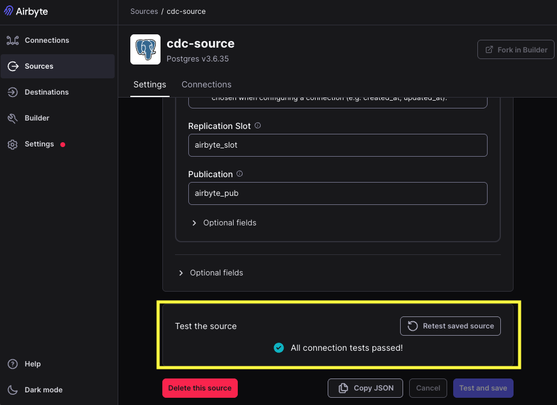

### Step 5: Set up Iceberg destination connector in Airbyte

In order to test CDC, we use the S3 datalake as destination (S3 + Iceberg + Glue Catalog).

1. Have the S3 bucket ready to store data for Iceberg table and create database in Glue so that Athena can read them.
```ruby
# aws CLI
aws glue create-database --database-input '{"Name": "iceberg_db"}'
```

2. In Airbyte, Select Destination -> `S3 Data Lake` and fill in the fields.
```ruby
- destination name: cdc-destiantion
- host: <host name of the Postgres DB>
- S3 Bucket Name: <bucket_name>
- S3 Bucket Path: <data_output_path>
- S3 Bucket Region: <aws_region>
- Warehouse Location: s3://<bucket name>/path/within/bucket (e.g. s3://my-iceberg-bucket/warehouse)
- Main Branch Name: main
- Catalog Type: Glue Catalog
  - AWS Account ID: <aws_account_id>
  - Default database: iceberg_db
```

3. Test the connection.
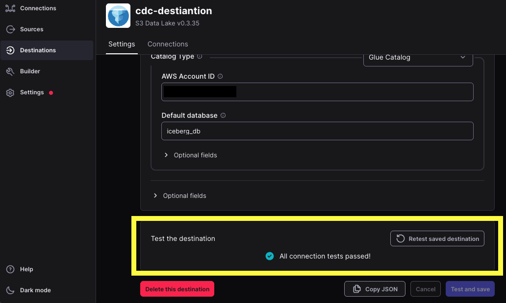

### Step 6: Test CDC with Incremental Dedupe Synchronization

1. Create new connection in Airbyte.
```ruby
- Source: cdc-source
- Destination: cdc-destination
- Stream:
   - select `customers`
   - sync mode: 
     - select `Replicate Source` (Maintain an up-to-date copy of your source data in the destination)
	 - select `Incremental | Append + Deduped`
- Configure connection: 
	- connection name: cdc-source → cdc-destiantion
	- schedule type: scheduled
	- replication freq: every 24 hrs
	- Destination Namespace: `Destination-defined` 
	  (Sync all streams to the schema defined in the destination's settings.)
```
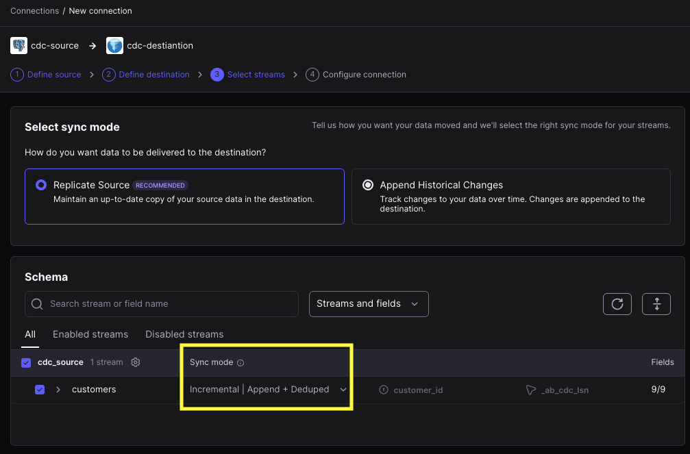
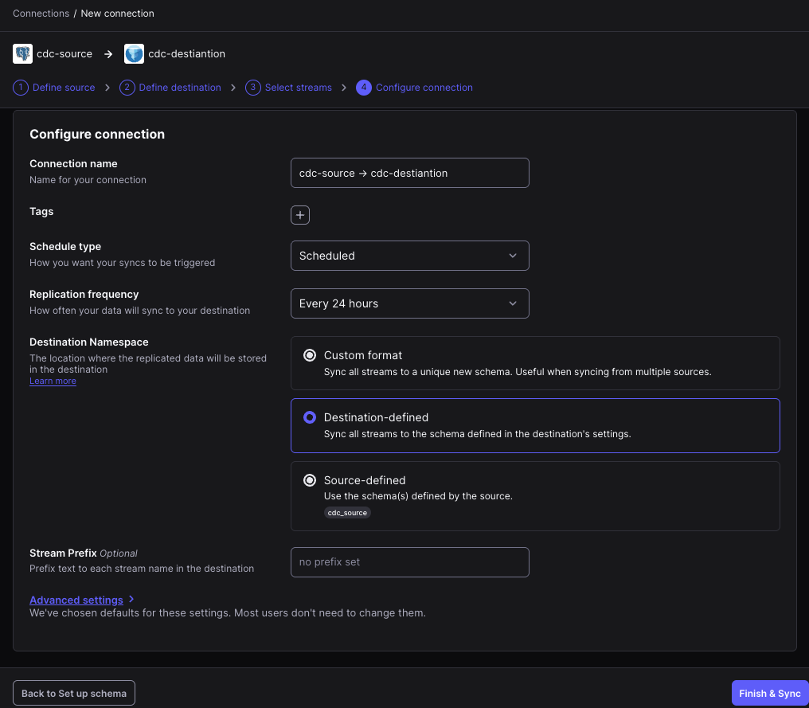

2. Click `Sync now` to start the first data sync in Airbyte. You can also check the pod `replication-job-xxx` status and logs.
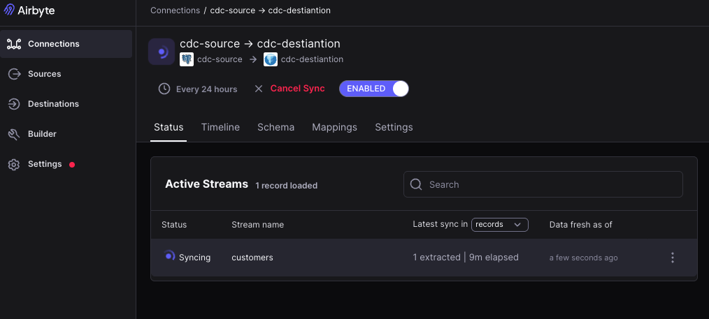
```ruby
kubectl get pod -n airbyte
kubectl logs replication-job-xxx -n airbyte --tail 100
```
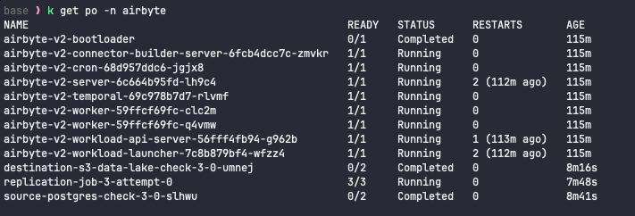

3. After the data sync completes, verify the data in Athena, S3, and the Glue Data Catalog.  You don’t need to create the table manually in Athena—the table definition is automatically created in the Glue Catalog, and Athena reads it from there.
```sql
SELECT * FROM iceberg_db.customers LIMIT 10;
```
Athena
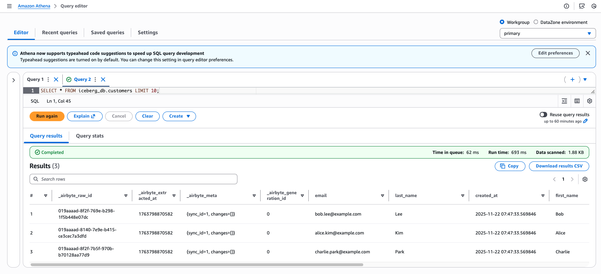
S3
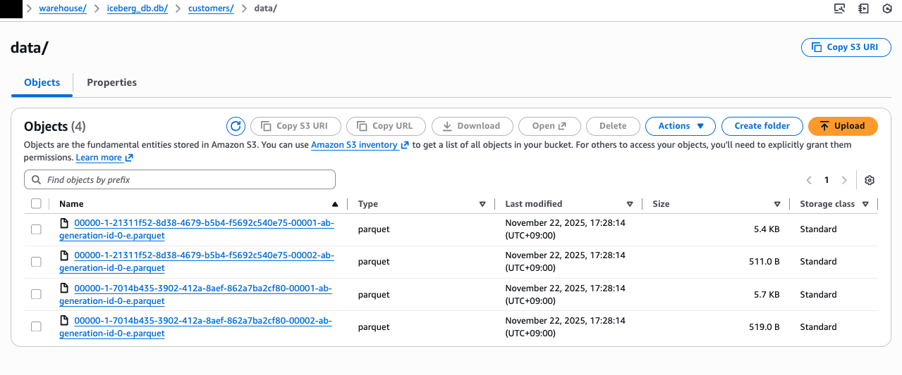
Glue
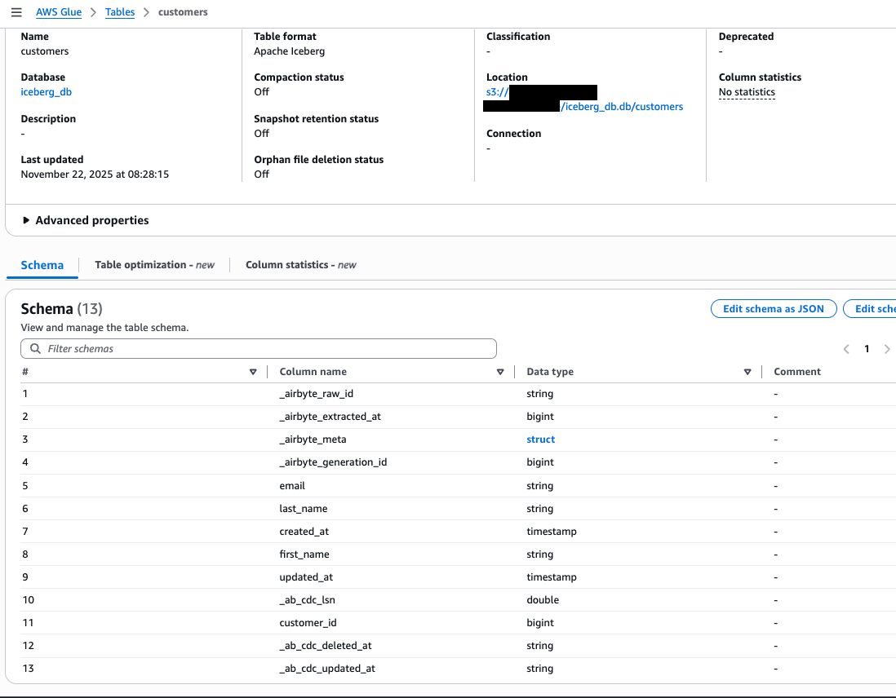

4. Now, we do a CDC test. Execute insert/update/delete queries in Postgres using `sql/3_source_dml.sql`  (database = `cdc_db`) .
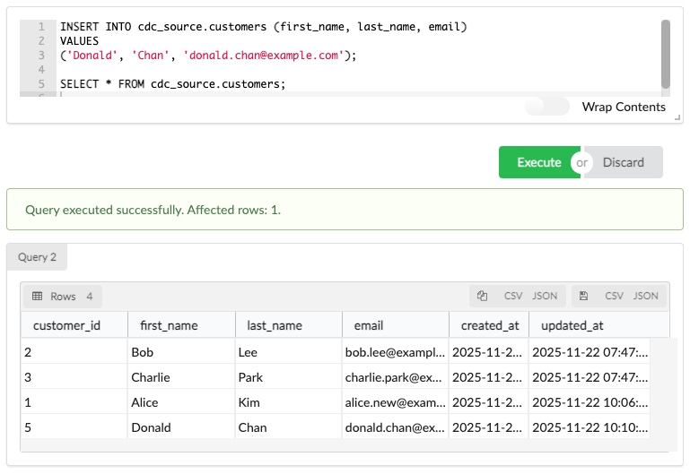

5. Click `Sync now` again to start data sync in Airbyte. Note that the sync frequency in Airbyte might have to be increased to avoid lagging behind WAL retention.

6. When sync job is done, check data again in Athena. You’ll see change in the table!
```sql
SELECT * FROM iceberg_db.customers LIMIT 10;
```

Airbyte UI
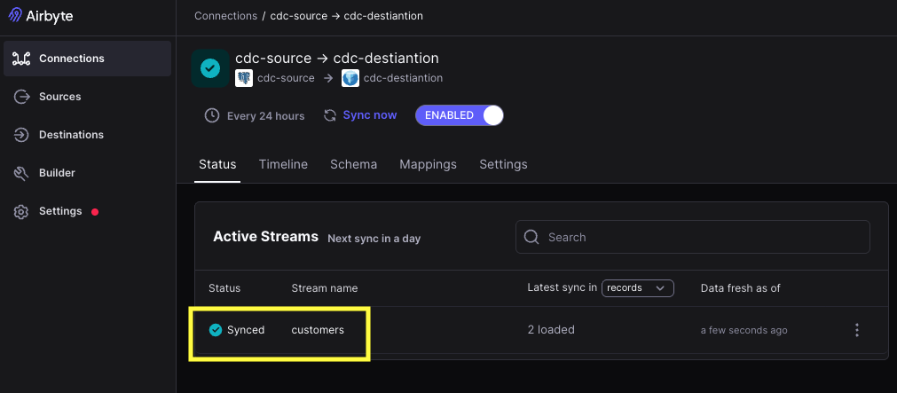

Athena
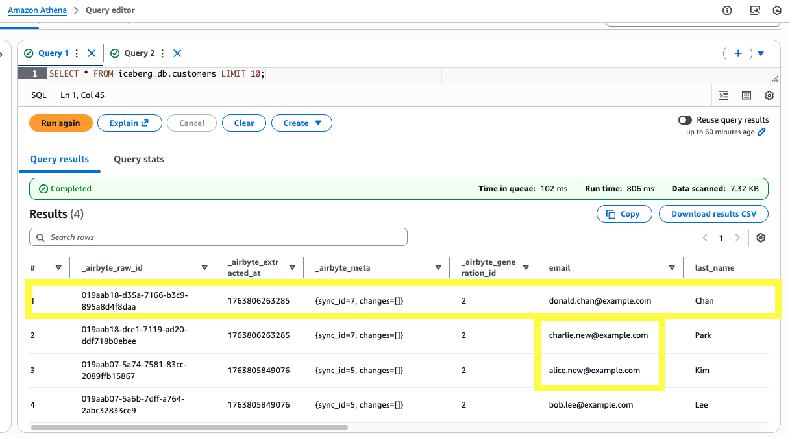
- New row is inserted: with email = `donald.chan@example.com`
- Existing values are updated: to `charlie.new@example.com` and to `alice.new@example.com`

7. Iceberg supports time travel. In Athena, you can query historical data by specifying a snapshot ID or a timestamp.
   => This confirms that the CDC changes are being captured and versioned incrementally in Iceberg.
```sql
SELECT * FROM "iceberg_db"."customers$history" order by made_current_at desc;

SELECT * FROM iceberg_db.customers FOR VERSION AS OF 4229096650788304753;
```
- List table history:
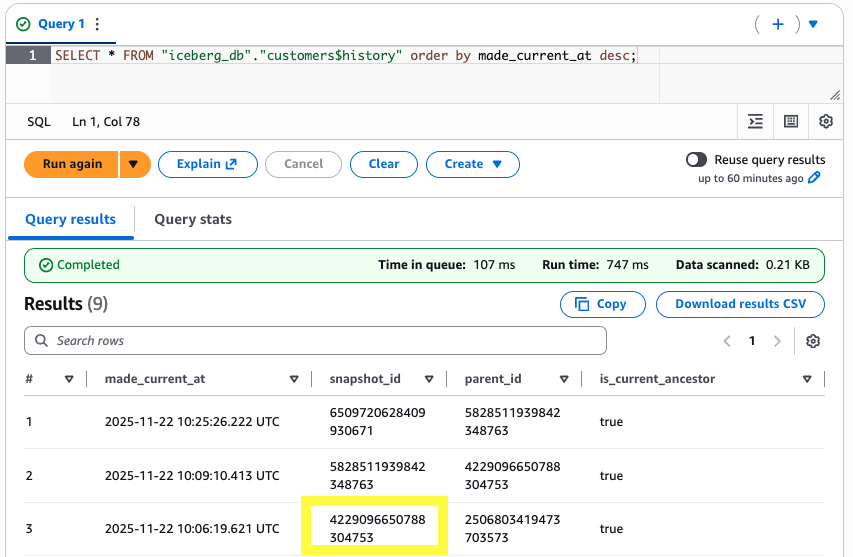

- Test time travel: 
  This snapshot version still shows `charlie.park@example.com`, even though the value has been updated to `charlie.new@example.com` in the latest snapshot.
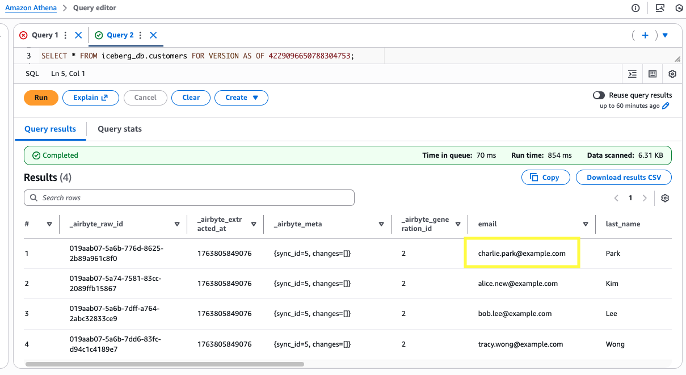
---
## Conclusion

This project demonstrates a complete end-to-end CDC pipeline on EKS using Airbyte, Postgres logical replication, and Iceberg on S3. While the setup is not fully production-ready, it successfully models the core concepts: containerized orchestration on EKS, CDC ingestion with Airbyte, and Iceberg’s snapshot-based table format for incremental analytics.

There are still areas that would need improvement for a true production deployment—for example, private-only access to Airbyte, WAL retention tuning to avoid missing change events, observability, compaction jobs, and hardening the network/security model.

Even so, this project provides a solid foundation and a clear demonstration of how modern CDC + lakehouse architectures work end-to-end on AWS.

---
## Clean up

1. Destroy the infrastructure built by terraform. (stage5 -> stage 4 -> stage 3 -> stage 2 -> stage 1)
```ruby
kubectl delete ingress --all -n airbyte

cd ../stage5-airbyte
terraform destroy --auto-approve

cd ../stage4-rds
terraform destroy --auto-approve

cd ../stage3-bastion
terraform destroy --auto-approve

cd ../stage2-addons
terraform destroy --auto-approve

cd ../stage1-eks
terraform destroy --auto-approve
```

2. At each folder level,  verify if terraform state return nothing - the state file has no managed resources left.
```ruby
terraform state list
```
OR
```ruby
kubectl get pods -A
kubectl get deploy -A
kubectl get svc -A
kubectl get sc -A
kubectl get pvc -A
helm list -A
```

3. Verify if all objects are deleted @AWS console. 
	   - EKS cluster
	   - RDS instances
	   - EC2s
	   - EBS volumes
	   - Load balancers

---
## Follow-ups
1. Implement **Karpenter** or Autoscaler which can dynamically provision and right-size nodes in an EKS (or Kubernetes) cluster to efficiently meet workload demands.
---
## References
- https://airbyte.com/tutorials/incremental-change-data-capture-cdc-replication
- https://medium.com/@kelvingakuo/self-hosting-airbyte-oss-on-aws-elastic-kubernetes-service-c74eb0bdb42d
- https://developer.hashicorp.com/terraform/tutorials/kubernetes/eks
- https://docs.airbyte.com/platform/deploying-airbyte/integrations/storage
- https://www.postgresql.org/docs/current/logicaldecoding-explanation.html
- https://hevodata.com/learn/postgresql-replication-slots/#Types_of_PostgreSQL_Replication_Slots
- https://docs.airbyte.com/integrations/sources/postgres
- https://docs.airbyte.com/integrations/destinations/s3-data-lake
- https://docs.airbyte.com/platform/deploying-airbyte/values
- https://docs.aws.amazon.com/athena/latest/ug/querying-iceberg-time-travel-and-version-travel-queries.html
- https://docs.aws.amazon.com/eks/latest/userguide/access-entries.html
- https://docs.aws.amazon.com/eks/latest/userguide/access-policy-permissions.html
- https://docs.aws.amazon.com/eks/latest/userguide/cluster-endpoint.html
- https://docs.aws.amazon.com/eks/latest/userguide/iam-roles-for-service-accounts.html
- https://docs.aws.amazon.com/eks/latest/userguide/managed-node-groups.html
- https://github.com/terraform-aws-modules/terraform-aws-eks/blob/master/examples/eks-managed-node-group/eks-al2023.tf
- https://github.com/terraform-aws-modules/terraform-aws-vpc/blob/v6.0.1/variables.tf
- https://medium.com/@StephenKanyiW/provision-eks-with-terraform-helm-and-a-load-balancer-controller-821dacb35066
- https://github.com/terraform-aws-modules/terraform-aws-iam/tree/master/modules/iam-assumable-role
- https://navyadevops.hashnode.dev/step-by-step-guide-creating-an-eks-cluster-with-alb-controller-using-terraform-modules
- https://github.com/terraform-aws-modules/terraform-aws-iam
- https://registry.terraform.io/providers/hashicorp/helm/latest/docs
- https://github.com/aws/eks-charts/tree/master/stable/aws-load-balancer-controller
- https://github.com/kubernetes-sigs/aws-ebs-csi-driver/tree/master/charts/aws-ebs-csi-driver
- https://medium.com/@jrkessl/kubernetes-kbac-permissions-model-and-how-to-add-users-to-aws-eks-c6d642f79a6d
- https://github.com/terraform-aws-modules/terraform-aws-eks/blob/master/variables.tf
